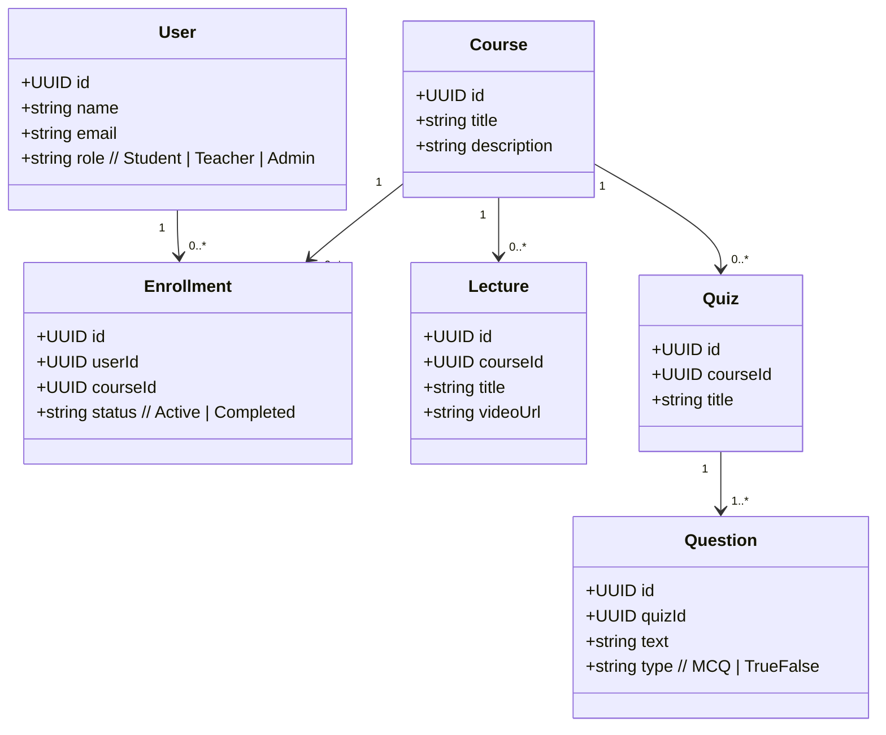
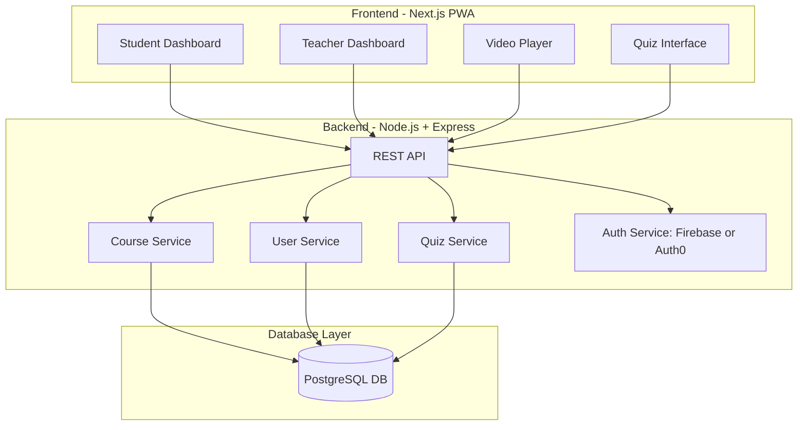

# Ta3allam Architecture Break down
Some diagrams and architectural principles that will be used to build this platform.

# Overall Class Diagram

```mermaid
classDiagram
    class User {
        +UUID id
        +string name
        +string email
        +string role  // Student | Teacher | Admin
    }

    class Course {
        +UUID id
        +string title
        +string description
    }

    class Enrollment {
        +UUID id
        +UUID userId
        +UUID courseId
        +string status  // Active | Completed
    }

    class Lecture {
        +UUID id
        +UUID courseId
        +string title
        +string videoUrl
    }

    class Quiz {
        +UUID id
        +UUID courseId
        +string title
    }

    class Question {
        +UUID id
        +UUID quizId
        +string text
        +string type  // MCQ | TrueFalse
    }

    User "1" --> "0..*" Enrollment
    Course "1" --> "0..*" Enrollment
    Course "1" --> "0..*" Lecture
    Course "1" --> "0..*" Quiz
    Quiz "1" --> "1..*" Question
```

# Domain model 

```mermaid
graph TD
    subgraph "Frontend - Next.js PWA"
        A[Student Dashboard]
        B[Teacher Dashboard]
        C[Video Player]
        D[Quiz Interface]
    end

    subgraph "Backend - Node.js + Express"
        E[REST API]
        F[Course Service]
        G[User Service]
        H[Quiz Service]
        I["Auth Service: Firebase or Auth0"]
    end

    subgraph "Database Layer"
        J[(PostgreSQL DB)]
    end

    A --> E
    B --> E
    C --> E
    D --> E

    E --> F
    E --> G
    E --> H
    E --> I

    F --> J
    G --> J
    H --> J
```

