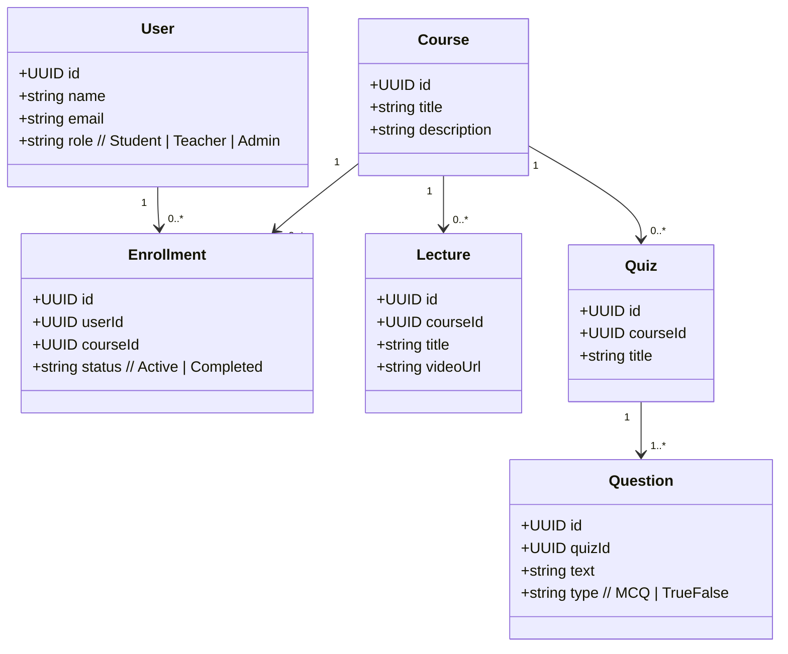
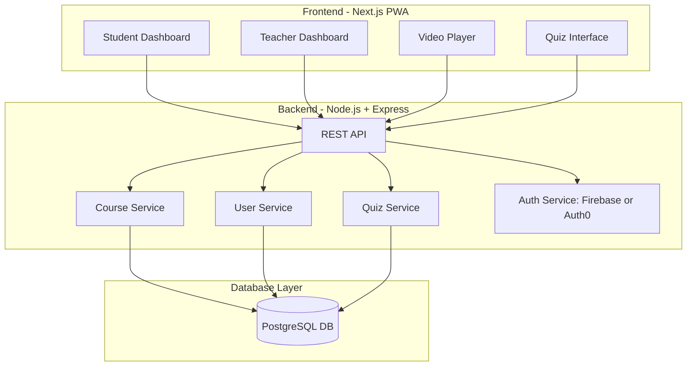

# Ta3allam Architecture Break down
Some diagrams and architectural principles that will be used to build this platform.

### **1. Core User Roles & Permissions**

* **Student**: View content, submit quizzes, track progress.
* **Teacher**: Upload/manage courses, create quizzes, review student activity.
* **Admin**: Manage users, approve teachers, moderate content, platform configuration.

---

### **2. Tech Stack (Fully Sovereign & Deployable on Self-Hosted Infrastructure)**

| Layer          | Technology                                               | Reason                                                     |
| -------------- | -------------------------------------------------------- | ---------------------------------------------------------- |
| **Frontend**   | Next.js (PWA) + TailwindCSS                              | SEO, SSR, Arabic RTL support, mobile-friendly              |
| **Backend**    | Node.js (Express)                                        | Scalable, JS ecosystem, custom logic                       |
| **Database**   | PostgreSQL                                               | Open-source, ACID, great for relational learning data      |
| **Auth**       | Firebase Auth (optional) or custom JWT + OTP/email login | Firebase for quick MVP, fallback to custom for sovereignty |
| **Storage**    | MinIO (self-hosted S3)                                   | Sovereign object storage for videos/docs                   |
| **Email**      | Self-hosted Mailer (e.g. Postal, Mailu)                  | Control notifications, teacher invites                     |
| **Deployment** | Docker + NGINX + Caddy (TLS)                             | Portable, server-controlled hosting                        |
| **CI/CD**      | GitHub Actions + Webhooks                                | Automate deployment securely                               |
| **Mobile**     | PWA + later: Expo (React Native)                         | MVP as PWA, native when scaling                            |

---

### **3. User Flows (MVP-Level)**

**Student**:

1. Sign up / log in
2. Browse grade-level courses
3. Watch videos
4. Take quizzes
5. Track progress
6. submit assigments

**Teacher**:

1. Apply → Admin approval
2. Upload lessons (video, PDF, quiz)
3. View student submissions

**Admin**:

1. Manage users
2. Assign teacher roles
3. Upload school-wide content

---

### **4. MVP Feature Scope**

✅ User registration/login
✅ Arabic RTL content
✅ Course creation (Title, video, file, quiz)
✅ Quizzes (MCQs) with scoring
✅ Basic progress dashboard
✅ Mobile-friendly PWA
✅ Admin panel (light)
✅ basic assigment Grading System

🚫 No live sessions (yet)
🚫 No chat/comments
🚫 No advanced analytics

---

### 5. Architecture
#### Overall Class Diagram

#### Domain model 

---

### **6. Localization (Arabic First)**

* Use `next-i18next` or `react-intl`
* RTL CSS (Tailwind supports it)
* Arabic UI/UX best practices (clear fonts, spacing, intuitive design)

---

### **7. Deployment Plan**

* Start with a VPS or local servers (e.g., Hetzner, OVH with sovereignty in mind)
* Dockerize everything (frontend, backend, db, storage)
* Use NGINX or Caddy for reverse proxy + TLS
* CI/CD with GitHub Actions for auto-deploy

